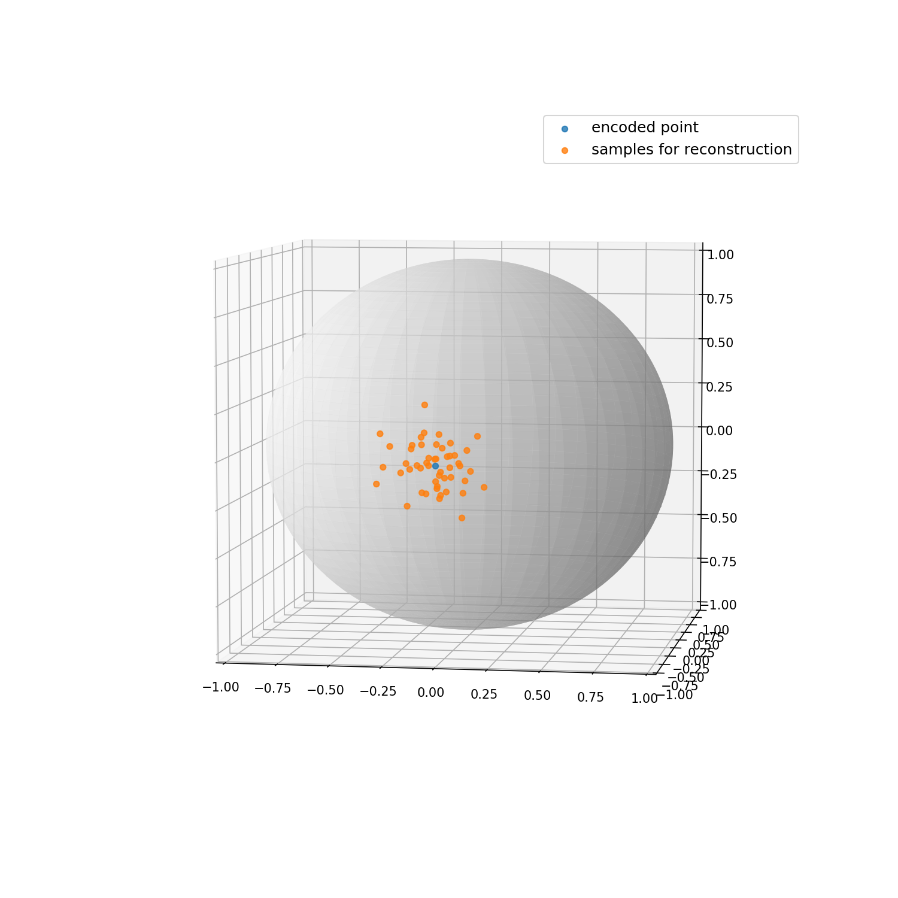
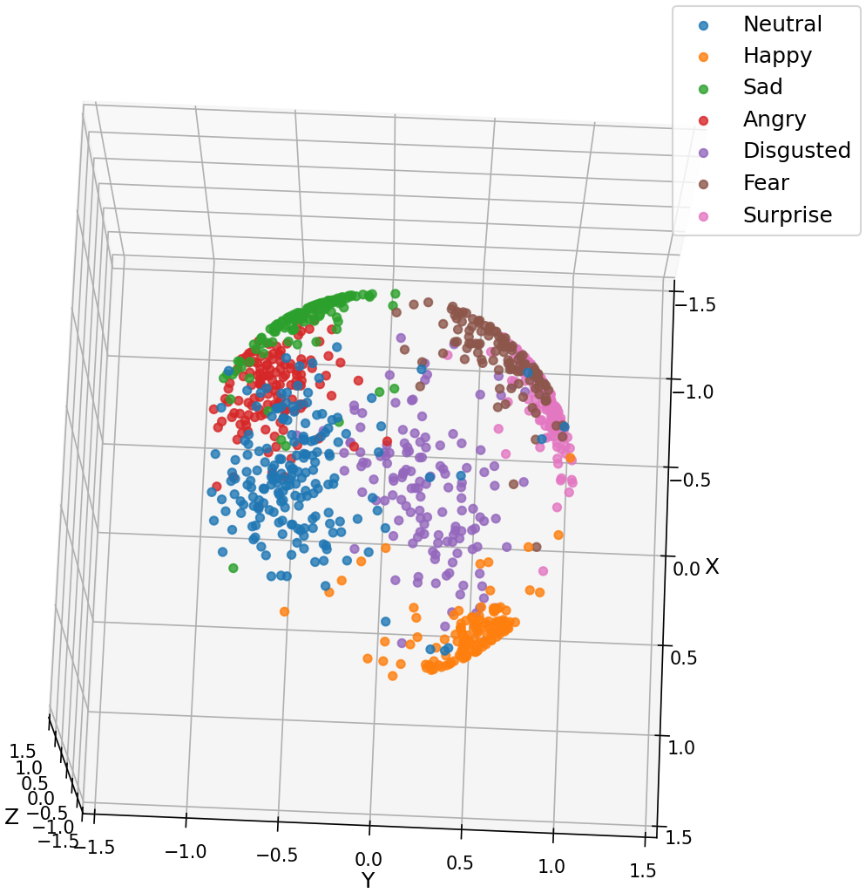

# vMF-VAE model with CAFE dataset

This is an add-on study to our first study which leveraged latent knowledge of VAE to guide the sampling process performed by MCMCP. 

## What is the purpose of training the vMF-VAE?

* The final target is to acquire a latent space with all encoded data arranged **sparsely** but also showing **seperated clusters** with as little overlap as possible;
* For both facial affect reconstruction and faical diversity;

## To achieve this, we

* apply the uniform distribution (vmf with kappa=0) as the prior distribution of the generative model, to avoid "the origin gravity" that squeezes the encoded data;
* add an extra classifier following the latent space that would be trained simultaneously with VAE, to leverage the categorical information and seperate clusters;

## Why don't use a 2-D ring as latent space?
Hard to seperate clusters and represent all kinds of facial affect in a limited space;
 
Increase radius to 2:

Manifold of the ring with kappa=300: 

## Model architecture

The model's architecture is showed below: 

## Hyper-parameter selection:
* n_epoch:
> Too small? classifier would be underfitted, clusters would not be seperated; too large? it will push different clusters away, reduce the diversity;

* kappa:
> If kappa is too small, the posteior distribution for reconstruction would be too wide, which means latent space would probabily reconstrut an average face; if kappa is too large, then the face would be too specific with too much diversity, instead of a continuous facial affect manifold.
> For example:

k=1  
k=100  
k=300  
k=3000  

> So the point is, the reconstruction area covered by a posterior distribution should take charge of an appropriate sub-area of a single cluster, so that clusters won't interfere one another and keep an acceptable diversity in image's generation (in my view).

## Finally, k=300 with 50 epoches shows a good latent space:
* Latent Space:

* Manifold:

 

* It also shows some good property like, similar area covered by different clusters and ambiguous facial affect in the gap between two clusters. 
* And also, a finite, closed latent space won't generate a face that looks crazy or even like anything but a face. From this standpoint, it aligns well with real representations in human's cognition, better than plane latent space. 

